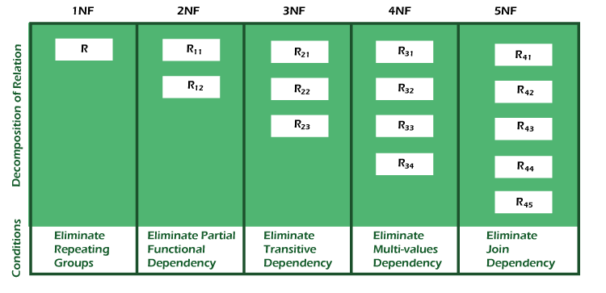

# Database Normalization

## What is Normalization?
- Process of organizing data in a database to reduce redundancy
- Helps eliminate undesirable characteristics like Insertion, Update, and Deletion Anomalies
- Divides larger tables into smaller ones and links them using relationships

## Why Normalization?
- Reduces data redundancy
- Ensures data integrity
- Improves database structure
- Prevents anomalies in data modification

## Data Modification Anomalies
1. **Insertion Anomaly**
    - Cannot insert new tuple due to lack of data
    
2. **Deletion Anomaly**
    - Deletion of data causes unintended loss of other important data
    
3. **Update Anomaly**
    - Single value update requires multiple row updates

## Types of Normal Forms

| Normal Form | Description |
|------------|-------------|
| 1NF | Contains atomic values |
| 2NF | In 1NF + non-key attributes fully dependent on primary key |
| 3NF | In 2NF + no transitive dependency |
| BCNF | Stronger version of 3NF |
| 4NF | In BCNF + no multi-valued dependency |
| 5NF | In 4NF + no join dependency |

## Advantages
- Minimizes data redundancy
- Better database organization
- Ensures data consistency
- Flexible database design
- Enforces relational integrity

## Disadvantages
- Requires thorough understanding of user needs
- Performance may degrade in higher normal forms
- Time-consuming process
- Risk of poor decomposition leading to design issues

## Summery
